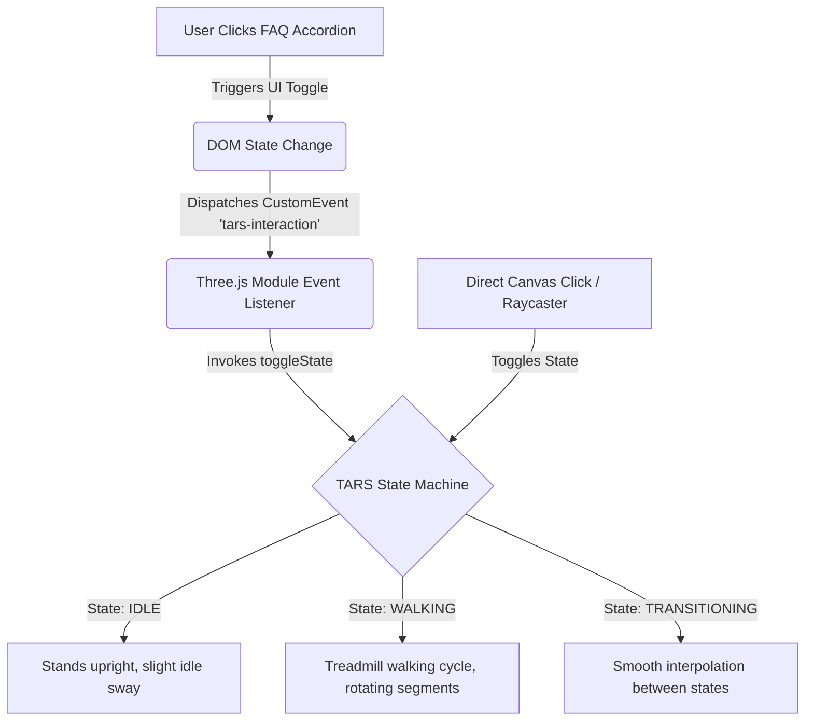

# Cicada 2067 - Cryptic Hunt Event Homepage

Welcome to the official developer documentation for the **Cicada 2067** event homepage. This repository hosts a dark, terminal-style, immersive interactive homepage for an interstellar cryptic puzzle event. It features high-contrast telemetry accents, monospaced typography, and a custom interactive 3D simulation of the **TARS** robot from *Interstellar*.

---

## 🚀 Getting Started

Since the project is a self-contained, client-side web application, you can launch it instantly without any complex builds.

### Quick Start
Simply open [cicada_homepage.html](file:///d:/IEEECS/Cicada%202067/homepage/cicada_homepage.html) in any modern web browser (Chrome, Firefox, Safari, Edge) by double-clicking it or dragging it into the window.

### Recommended Development Servers
For features like hot-reloading and proper module loading, run a local development server in the `homepage/` directory:

*   **Python 3.x:**
    ```bash
    python -m http.server 8000
    ```
    Then visit: `http://localhost:8000/cicada_homepage.html`
*   **Node.js (NPX):**
    ```bash
    npx http-server .
    ```
    Then visit the address output in the terminal.

---

## 📁 Repository Structure

```text
homepage/
├── cicada_homepage.html   # Main self-contained event homepage (HTML/CSS/JS)
├── DESIGN.md              # Design system tokens (colors, layout, typography)
├── README.md              # Project documentation (this file)
├── gemini.html            # Legacy/backup template page
├── tars_widget.html       # Legacy standalone TARS widget code
└── screen.png             # Reference mock-up screenshot
```

---

## 🎨 Theme & Design System ("Obsidian Protocol")

The visual hierarchy is designed to evoke a digital space console or a classified computer terminal. Detailed tokens are located in [DESIGN.md](file:///d:/IEEECS/Cicada%202067/homepage/DESIGN.md).

*   **Obsidian Void (`#131313` / `#0e0e0e`):** The infinite dark backdrop that minimizes distraction and places full focus on the cryptic content.
*   **Glowing Copper (`#C58B6D` / `#f8b898`):** The primary brand color used for borders, headings, and active interactive elements.
*   **Warm Accent (`#8b5e3c`):** Utilized for soft background glows and matching directional fill lights in the 3D scene.
*   **Telemetry Scanline:** A subtle global linear overlay that gives the entire screen a tactile CRT or high-resolution display texture.

---

## 🤖 TARS Web Assistant Architecture

The highlights of this homepage include a custom-crafted Three.js TARS interactive robot. It behaves as a physical assistant rather than an isolated 3D viewport, responding to page state and user inputs.



### 1. 3D Model Construction
TARS is modeled procedurally using `BoxGeometry` to maintain a light asset footprint:
*   **Four independent segments:** Built with a configured thickness of `0.37` and height of `2.4`.
*   **Brushed Steel Material:** Built using a `MeshStandardMaterial` optimized with a metallic rating of `0.6` and roughness of `0.35` to capture lighting highlights cleanly.
*   **Outer Ridges:** The two outer segments feature vertical ridged sleeves. These are built using a `BoxGeometry` mapping a custom procedural canvas texture with vertical lines that wrap 360° around the segment edges.
*   **Inner Screens:** The two middle segments feature dark, glossy black screen planes on both the upper and lower sections.
*   **Detail Decals:** Custom transparent canvas textures are projected onto the front face of the inner segments:
    *   **Segment 1 (Inner Left):** Features the orange vertical **"TARS"** brand lettering and a pulsing green telemetry grid on the top screen.
    *   **Segment 2 (Inner Right):** Features matching orange vertical **Braille dots** corresponding to the name TARS.

### 2. State Machine & Animation Controller
The segment rotations and walk sequences are managed inside the Three.js render loop using a 3-state machine:

1.  **`IDLE` (State 0):** The robot stands vertically. A low-frequency sine wave is applied to the outer segments to simulate a natural breathing/telemetry sway.
2.  **`WALKING` (State 1):** The outer legs (`segments[0]` and `segments[3]`) and inner legs (`segments[1]` and `segments[2]`) rotate in opposite directions using a cosine-offset phase to perform a classic "treadmill" walking cycle.
3.  **`TRANSITIONING` (State 2):** Smoothly interpolates the segment rotation angles and position coordinate offsets from the current state to the target state using linear interpolation (LERP) over a `0.8` second window.

### 3. Page Interaction & Event Bridge
TARS is closely integrated with the website's DOM structure:
*   **FAQ Accordion Linking:** Whenever a user clicks on an FAQ question block to view an answer, a JavaScript event listener dispatches a custom event:
    ```javascript
    window.dispatchEvent(new CustomEvent("tars-interaction", { detail: { active: true } }));
    ```
*   TARS listens for this event. Opening any FAQ item starts the walking loop; closing it stops the loop and returns TARS to the idle state.
*   **Direct Click Raycasting:** Clicking directly on TARS's canvas container casts a ray into the scene. If a segment is intersected, it manually toggles the walk cycle.
